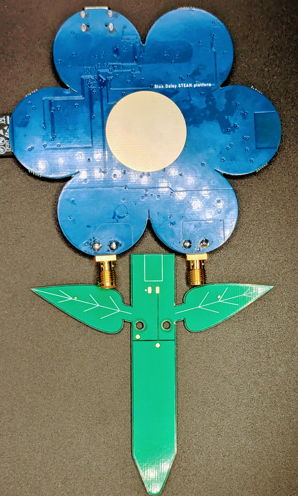
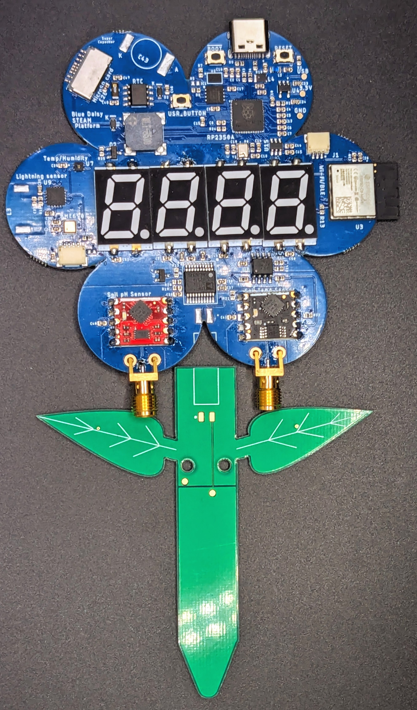
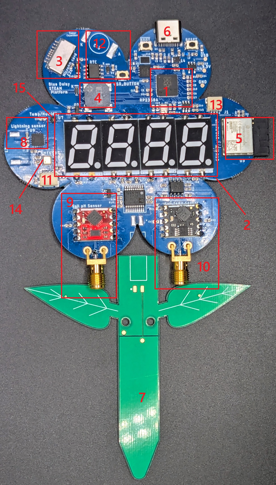

# Purple Daisy RP2350A STEAM Platform #

This is the repository for the Purple Daisy Platform based on the [Raspberry Pi RP2350A Microcontroller](https://www.raspberrypi.com/products/rp2350/). This is an open-source platform to conduct citizen science experiments using the Raspberry Pi RP2350A microcontroller. 

The board looks something like shown in the image below:

The components of the board are highlighted in the image below. They are as follows:

1. Raspberry PI RP2350A microcontroller
2. RGB seven segment display - 4 characters
3. MicroSD card slot
4. Buzzer
5. WiFi Module
6. USB-C port
7. Soil Moisture sensor
8. AS3935 Lightning Sensor
9. pH Sensor + Conditioning Circuit
10. Liquid Temperature sensor
11. QwiiC I2C Sensor port to connect additional sensors
12. Real Time Clock for Calendar Keeping
13. Debug Port for debugging
14. BME690 Air Quality Sensor
15. ENS210 Temperature Humidity Sensor

